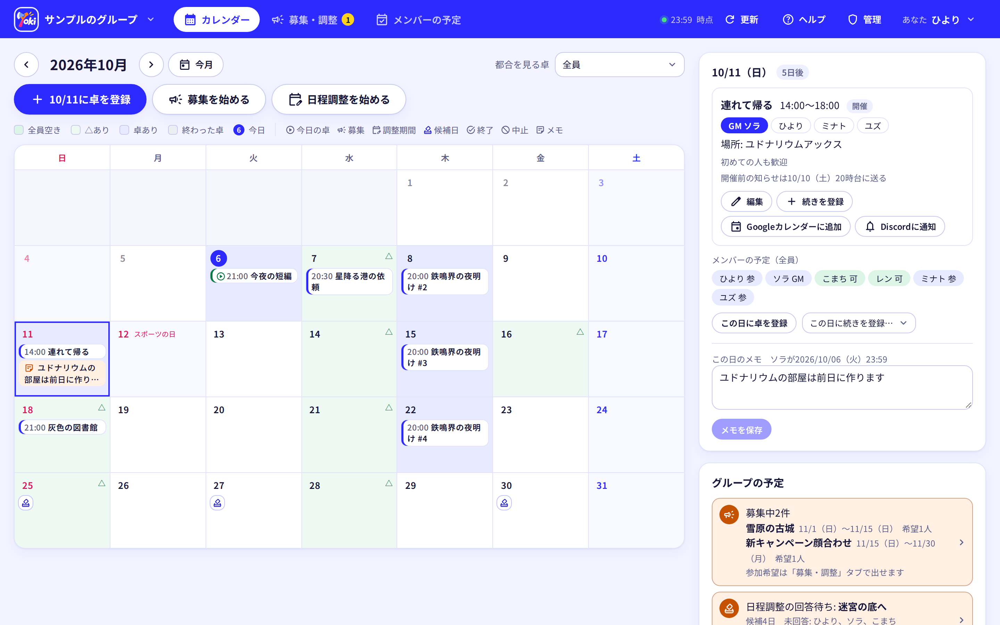

<p align="center">
  
</p>

<h1 align="center">Yoki</h1>

<p align="center">TRPGの卓の予定を、Discordサーバーの仲間と決めるWebアプリ</p>

<p align="center">
  <a href="https://github.com/Xelltis/yoki/releases/latest"></a>
  <a href="https://github.com/Xelltis/yoki/actions/workflows/deploy.yml"></a>
  <a href="https://xelltis.github.io/yoki/"></a>
  <a href="LICENSE"></a>
  <br>
  <a href="https://developers.cloudflare.com/workers/"></a>
  <a href="https://react.dev/"></a>
  <a href="https://hono.dev/"></a>
  <a href="https://www.typescriptlang.org/"></a>
</p>

<p align="center">
  <a href="https://deploy.workers.cloudflare.com/?url=https://github.com/Xelltis/yoki/tree/release"></a>
</p>

<p align="center">
  <a href="https://xelltis.github.io/yoki/">使い方</a> ·
  <a href="https://xelltis.github.io/yoki/setup/">設置する</a> ·
  <a href="CONTRIBUTING.md">開発に参加する</a> ·
  <a href="https://xelltis.github.io/yoki/releases/">リリースノート</a>
</p>



Yokiは、TRPGの卓の予定をDiscordサーバーの仲間と管理するWebアプリです。仲間の都合から全員が空いている日を見つけ、募集・日程調整・Discordへの知らせまでを1か所で済ませます。

グループはDiscordサーバーごとに作り、入れるのはそのサーバーにいる人だけです。だれでも自分のCloudflareに設置でき、Cloudflareの無料のプランで動きます。

## できること

| 機能 | 中身 |
|---|---|
| 全員が空いている日が分かる | メンバーは行けない日に △ か × を付けるだけ。全員の印から、全員が空いている日がカレンダーに出る |
| 募集と日程調整 | 参加者を募り、候補日に ◯ か × で答えてもらい、GMが開催日を決める |
| シナリオと通過 | グループのシナリオと、だれが通過したかを持つ。まだ通過していない人が集まれる日を出す |
| 卓の準備 | HOの割り当て・GMと本人にだけ見える秘匿HO・キャラシの提出と締め切りを、卓ごとにまとめる |
| Discordへの知らせ | 開催前の知らせ・日程調整の呼びかけ・回答がそろったことを、Botがチャンネルに送る。メンションも付く。開催の卓を、サーバーのイベントにも出せる |
| Discordでログイン | 入れるかは、Discordサーバーにいるかで決まる。Googleのアカウントを結びつければ、Googleでもログインできる |
| カレンダーに出す | 参加する卓を、購読URLかGoogleカレンダーとの連携で、自分のカレンダーに出す |
| 運営の管理画面 | 設置した人が、利用者・グループ・新規登録の受付・規約・新しいバージョンへの更新を扱う |

画面の使い方をまとめたのが、[使い方のサイト](https://xelltis.github.io/yoki/)です。

## 設置する

上の「Deploy to Cloudflare」のボタンから、自分のCloudflareに設置できます。

| 手順 | すること |
|---|---|
| 1 | Discord Developer PortalでDiscordアプリを作り、Client ID・Client Secret・Botのトークンを控える |
| 2 | ボタンを押し、控えた値とあなたのDiscordユーザーIDを入れる。CloudflareがGitHubのリポジトリとデータベースを作り、公開まで済ませる |
| 3 | 公開のアドレスを、Discordアプリの「リダイレクト」に入れる |

くわしい手順は、サイトの「[設置する](https://xelltis.github.io/yoki/setup/)」にあります。新しいバージョンが出たら、運営の管理画面の「更新」から取り込めます（[新しいバージョンに上げる](https://xelltis.github.io/yoki/setup/update)）。

## 仕組み

サーバーは [Cloudflare Workers](https://developers.cloudflare.com/workers/)（TypeScript・[Hono](https://hono.dev/)）、データは [D1](https://developers.cloudflare.com/d1/)（SQLite）です。画面はReactの1つのSPA（TanStack Router・TanStack Query・Tailwind CSS）で、ログインはDiscordのOAuthです。知らせは、YokiのDiscordのBotがチャンネルに送ります。

## 文書

| 読む人 | 文書 | 中身 |
|---|---|---|
| 使う人 | [使い方のサイト](https://xelltis.github.io/yoki/) | 予定の入れ方・卓の登録・日程調整・シナリオ・卓の準備・Discordへの知らせ・グループの管理 |
| 設置する人 | [設置する](https://xelltis.github.io/yoki/setup/) | ボタンでの設置・新しいバージョンに上げる・Googleとの連携・独自のドメイン・運営の管理画面 |
| 開発する人 | [CONTRIBUTING.md](CONTRIBUTING.md) | 手元で動かす・テスト・書くときの決まり・コミット・バージョンを出す |
| 開発する人 | [docs/architecture.md](docs/architecture.md) | 作りと、そう決めた理由 |
| 開発する人 | [docs/deployment.md](docs/deployment.md) | 公開と更新の仕組み、GitHub Actionsでの公開 |
| 弱いところを見つけた人 | [SECURITY.md](SECURITY.md) | セキュリティの問題を、Issueに書かずに非公開で知らせる方法 |

## 開発する

Node.js（22.12以降か24以降）があれば、手元で動かせます。DiscordとCloudflareのアカウントは要りません。文書の日本語の検査（`npm run lint`）には、Python 3も使います。

```sh
npm install
npm run dev
```

http://localhost:5173/ を開き、「開発用ログイン」を押すと、サンプルのグループに入れます。テストや書くときの決まりは、[CONTRIBUTING.md](CONTRIBUTING.md) を読んでください。

## ライセンス

[MIT](LICENSE)

使っている第三者のソフトウェアと素材（Reactなどの部品・Material Symbolsのアイコン・日本語の検査のyomiyasuなど）と、そのライセンスは、[THIRD_PARTY_NOTICES.md](THIRD_PARTY_NOTICES.md) にまとめてあります。
